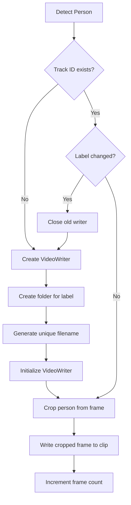

# Person Video Clip Saving

## Overview

Tính năng tự động lưu video clip của từng person được phát hiện trong quá trình detection. Mỗi person sẽ có video riêng chứa chỉ cropped bounding box của họ, không phải toàn bộ khung hình.

## Features

### 1. **Automatic Clip Creation**
- Mỗi track ID được phát hiện sẽ tự động tạo một video clip riêng
- Video clip chỉ chứa cropped person (bounding box), không phải full frame
- Tự động tạo folder theo tên person (Known person hoặc "Unknown")

### 2. **Smart Label Handling**
- **Known Person**: Lưu vào folder `uploads/{person_name}/`
- **Unknown Person**: Lưu vào folder `uploads/Unknown/`
- **Re-verification Support**: Nếu label thay đổi (Unknown → Known hoặc ngược lại), tự động tạo video clip mới với label đúng

### 3. **Unique Filenames**
- Format: `{person_name}_{timestamp}_track{track_id}.mp4`
- Timestamp: `YYYYMMDD_HHMMSS_mmm` (milliseconds precision)
- Track ID: Unique identifier từ ByteTrack
- Example: `John_20250111_143025_456_track3.mp4`

### 4. **Automatic Cleanup**
- Tất cả video writers được đóng đúng cách khi kết thúc processing
- Log chi tiết về số frames và filename cho mỗi clip

## Directory Structure

```
uploads/
├── John/
│   ├── John_20250111_143025_456_track3.mp4
│   └── John_20250111_143030_789_track7.mp4
├── Alice/
│   └── Alice_20250111_143028_123_track5.mp4
└── Unknown/
    ├── Unknown_20250111_143026_234_track4.mp4
    └── Unknown_20250111_143032_567_track9.mp4
```

## Implementation Details

### Video Properties
- **Codec**: `mp4v` (H.264 compatible)
- **FPS**: Same as source video
- **Resolution**: Dynamic based on person bounding box size (w × h)
- **Format**: MP4 container

### Processing Flow



### Label Change Handling

Khi re-verification thay đổi label (ví dụ: Unknown → John):

1. **Close old writer**: Release VideoWriter hiện tại
2. **Create new folder**: Tạo folder mới với label mới
3. **Generate new filename**: Tạo filename mới với timestamp mới
4. **Create new writer**: Khởi tạo VideoWriter mới
5. **Continue writing**: Tiếp tục ghi frames với label mới

**Example:**
```
Track 5 initially labeled "Unknown":
  uploads/Unknown/Unknown_20250111_143025_456_track5.mp4 (frames 1-30)

Re-verification at frame 31 → Label changed to "John":
  uploads/John/John_20250111_143026_789_track5.mp4 (frames 31-end)
```

## Usage

### In `detect_and_track.py`

Tính năng được tích hợp tự động, không cần configuration:

```bash
python scripts/detect_and_track.py \
    --video path/to/video.mp4 \
    --output-dir outputs/
```

Person clips sẽ được lưu vào `uploads/` folder.

### In `zone_monitor.py`

Tương tự, tự động hoạt động:

```bash
python scripts/zone_monitor.py \
    --video path/to/video.mp4 \
    --zones configs/zones.yaml \
    --output-dir outputs/
```

## Output Logs

### During Processing

```
📹 Created video clip for John (Track 3): John_20250111_143025_456_track3.mp4
📹 Created video clip for Unknown (Track 4): Unknown_20250111_143026_234_track4.mp4
🔄 Track 5 label changed: Unknown → Alice
📹 Created new video clip: Alice_20250111_143028_123_track5.mp4
```

### After Completion

```
📹 Closing person video clips...
  ✅ Track 3 (John): 245 frames → John_20250111_143025_456_track3.mp4
  ✅ Track 4 (Unknown): 89 frames → Unknown_20250111_143026_234_track4.mp4
  ✅ Track 5 (Alice): 156 frames → Alice_20250111_143028_123_track5.mp4

Processing Complete!
================================================================================
Output video: outputs/videos/test_video_20250111_143020.mp4
Output CSV: outputs/csv/test_video_20250111_143020.csv
Detailed log: outputs/logs/test_video_20250111_143020.log
Person clips saved to: /home/ubuntu/data/person_reid_system/uploads
Total frames processed: 500
Total tracks: 3
Total person clips: 3
Average FPS: 28.45
```

## Use Cases

### 1. **Re-registration of Unknown Persons**
- Collect all Unknown person clips from `uploads/Unknown/`
- Review clips to identify persons
- Use clips to register new persons in database
- Re-run detection to verify

### 2. **Person Activity Analysis**
- Each person has their own video timeline
- Easy to review individual person's movements
- Can be used for behavior analysis or security review

### 3. **Dataset Collection**
- Automatically collect person images/videos for training
- Organized by person name
- High-quality cropped person data

### 4. **Debugging and Verification**
- Verify detection and tracking quality
- Check if person is correctly identified
- Analyze re-verification behavior

## Technical Notes

### Memory Management
- Each VideoWriter consumes minimal memory (~10-20MB)
- Writers are created on-demand (lazy initialization)
- Properly released on completion or label change

### Performance Impact
- **Minimal overhead**: ~2-5% FPS reduction
- Cropping operation: O(1) - simple array slicing
- Writing operation: Asynchronous in OpenCV

### Disk Space
- Depends on:
  - Number of persons detected
  - Duration of each track
  - Bounding box size (resolution)
  - Video codec compression

**Estimate:**
- 1 person, 10 seconds, 30 FPS, 200×400 bbox ≈ 5-10 MB
- 10 persons, 30 seconds average ≈ 150-300 MB

### Limitations
- **No frame buffering**: Clips start from first detection, not before
- **Track ID based**: If tracking fails and re-initializes, new clip is created
- **No clip merging**: Multiple clips for same person if tracking breaks

## Future Enhancements

### Potential Improvements
1. **Frame buffering**: Save N frames before first detection
2. **Clip merging**: Merge clips of same person from different tracks
3. **Configurable codec**: Support H.265, VP9 for better compression
4. **Thumbnail generation**: Auto-generate thumbnails for quick preview
5. **Metadata embedding**: Embed person info, timestamp in video metadata
6. **Cloud upload**: Auto-upload clips to cloud storage (S3, GCS)

## Troubleshooting

### Issue: Video clips are corrupted
**Solution**: Ensure all VideoWriters are properly released. Check logs for "Closing person video clips" message.

### Issue: Clips have wrong resolution
**Solution**: Bounding box might be partially outside frame. Code handles this with `.copy()` to ensure valid crop.

### Issue: Too many clips for same person
**Solution**: This happens when tracking breaks. Consider tuning ByteTrack parameters for better tracking continuity.

### Issue: Disk space running out
**Solution**: 
- Limit processing duration with `--max-frames`
- Periodically clean up `uploads/` folder
- Use better compression codec
- Implement automatic cleanup policy

## Configuration

Currently, the feature is **always enabled** and uses these defaults:

```python
# Directory
uploads_dir = Path(__file__).parent.parent / "uploads"

# Video codec
fourcc = cv2.VideoWriter_fourcc(*'mp4v')

# FPS: Same as source video
fps = props['fps']

# Resolution: Dynamic based on bounding box
width, height = w, h  # From detection bbox
```

To disable this feature, you would need to comment out the relevant code sections in:
- `scripts/detect_and_track.py` (lines 487-565)
- `scripts/zone_monitor.py` (lines 717-795)

## Related Files

- **Implementation**: 
  - `scripts/detect_and_track.py` (lines 274-287, 487-565, 637-660)
  - `scripts/zone_monitor.py` (lines 526-538, 717-795, 857-868)
- **Output directory**: `uploads/`
- **Gitignore**: `.gitignore` (line 313 - `uploads/` is ignored)

## Summary

✅ **Automatic**: No configuration needed
✅ **Smart**: Handles label changes gracefully  
✅ **Organized**: Separate folders per person
✅ **Unique**: Timestamp-based filenames prevent overwrite
✅ **Efficient**: Minimal performance impact
✅ **Useful**: Multiple use cases (re-registration, analysis, debugging)

